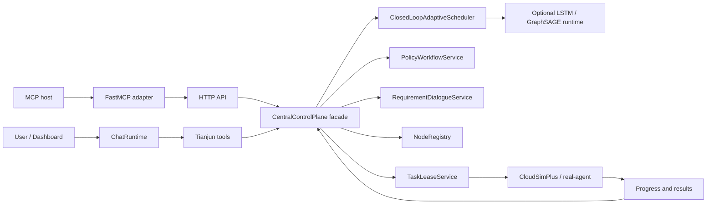

# Tianjun Engine

Tianjun Engine 是一个本地优先的算网调度控制平面原型。它把自然语言需求对话、确定性多目标调度、可选 ML 辅助预测、执行反馈、MCP 工具和静态 Dashboard 连接成一个可运行的研究系统。

本项目用于研究、演示和架构实验，并非生产级云平台。资源清单、定价、拓扑和执行事实必须来自已注册节点、仿真后端、CloudSimPlus 桥接器或真实节点代理；LLM 可以解释和帮助解析意图，但不能在没有明确确认路径的情况下捏造控制平面事实或提交工作。

## 快速开始

### 0. 安装依赖

需要 Python 3.10 或更新版本。

```powershell
python -m venv .venv
.\.venv\Scripts\Activate.ps1
python -m pip install --upgrade pip
python -m pip install -e ".[dev,mcp,ml-runtime]"
```

### 1. 配置并验证 LLM

不要把真实 API Key 写入仓库文件。推荐使用本地 secrets 文件：

```powershell
python -B main.py secrets --config configs\tianjun.example.toml set deepseek --api-key "your_api_key_here"
python -B main.py llm-check --config configs\tianjun.example.toml
```

### 2. Windows 启动脚本

Windows 用户可以使用统一脚本入口，或使用后面的指令：

```cmd
tianjun.bat start
tianjun.bat restart
tianjun.bat stop
tianjun.bat open
tianjun.bat smoke
```

`tianjun.bat start` 会在 LLM 校验通过后启动控制平面、MCP server 并打开 Dashboard，不会自动启动仿真节点。`tianjun.bat smoke` 只做离线 smoke test，不代表完整启动。

### 3. 启动控制平面

在第一个终端运行：

```powershell
python -B main.py serve `
  --config configs\tianjun.example.toml `
  --default-execution-mode simulation `
  --host 127.0.0.1 `
  --port 8024
```

验证服务：

```powershell
Invoke-RestMethod http://127.0.0.1:8024/health
Invoke-RestMethod http://127.0.0.1:8024/report
```

### 4. 可选：启动 Java CloudSimPlus DCI 示例

CloudSimPlus 示例用于本地演示、DCI 参考实验和 HTTP API 兼容性验证。它不是 Tianjun Engine 的正式仿真后端，不参与 Python 包安装，也不替代真实节点代理的 lease-based 执行链路。

CloudSimPlus 桥接器和参考实验位于 `examples/cloudsimplus/`：

```text
examples/cloudsimplus/src/main/java/org/cloudsimplus/examples/HuaweiDciTianjunExperiment.java
examples/cloudsimplus/src/main/java/org/cloudsimplus/examples/tianjun/TianjunHttpBridge.java
examples/cloudsimplus/src/main/resources/huawei-dci-reference.brite
```

本仓库中的 `examples/cloudsimplus/` 已经是可直接运行的独立 Maven 工程，固定使用稳定版 `CloudSim Plus v8.5.7`。在该目录执行：

```powershell
mvn clean compile
mvn exec:java "-Dexec.args=http://127.0.0.1:8024 normal"
```

该实验会创建 24 个仿真 VM，注册 DCI 拓扑和节点，持续发送心跳，通过 Tianjun 控制平面提交调度任务，并在 CloudSimPlus 仿真完成后回传执行结果。

### 5. 打开 Dashboard

在浏览器打开：

```text
http://127.0.0.1:8024/dashboard
```

Dashboard 是静态 HTML/CSS/JS，无构建步骤。启动 CloudSimPlus 示例或真实节点代理后，节点/拓扑页面应能看到已注册节点；聊天和策略流程使用官方 `/chat/sessions*` API；真实任务执行由节点侧进程通过租约、进度和结果回报推进。

### 6. 启动 MCP 工具服务

如果需要让 Hermes/MCP 主机调用 Tianjun 工具，在第三个终端运行：

```powershell
python -B main.py mcp-server `
  --config configs\tianjun.example.toml `
  --server http://127.0.0.1:8024
```

MCP server 会把 Tianjun HTTP API 包装为工具，包括读取集群状态、开始/继续聊天会话、起草/比较/仿真/解释策略，以及带确认边界的策略提交和任务调度。

### 7. 可选：真实节点代理

如需使用真实节点遥测代理，而不是模拟节点：

```powershell
python -B main.py real-agent `
  --config configs\tianjun.example.toml `
  --server http://127.0.0.1:8024 `
  --node-config examples\real_node_agent.example.json
```

默认不会执行真实任务。只有在确认主机隔离、命令允许列表、资源限制和审计策略后，才应使用 `--execute`。

### 8. 离线 smoke test

```powershell
python scripts\smoke_test.py --port 8135
```

该脚本会启动离线控制平面，检查 `/health`、`/report`、`/dashboard`，并验证 MCP 工具契约可导入。它用于快速验证，不代表完整启动。


## LLM 配置

离线模式适合本地冒烟验证。要启用 OpenAI 兼容的 Hermes 聊天层，请按“完整本地启动”的第 1 步配置并验证 LLM，并将 API 密钥存储在仓库之外。

项目 `.env` 和 `DEEPSEEK_API_KEY` 也受支持，但本地开发推荐使用 `secrets` 命令。

## 架构概览



核心入口：

- CLI：`main.py` 或安装后的 `tianjun`
- HTTP 服务器：`src/tianjun/interfaces/http/server.py`
- Dashboard 资源：`src/tianjun/interfaces/dashboard/static/`
- 控制平面门面：`src/tianjun/application/control_plane.py`
- MCP 适配器：`src/tianjun/integrations/mcp_server.py`

当前服务边界：

- `NodeRegistry`：节点注册、心跳和节点状态变更。
- `TaskLeaseService`：任务提交、预览、待调度任务、租约发放和租约激活。
- `RequirementDialogueService`：需求解析和需求会话生命周期。
- `PolicyWorkflowService`：策略起草、比较、模拟、提交、反馈解析和优化。
- `src/tianjun/cli/commands/`：CLI 命令处理器；`tianjun.cli` 只负责参数、配置和分发。

## 文档

- [文档索引](docs/README.md)
- [架构](docs/architecture.md)
- [HTTP API](docs/api.md)
- [弃用与遗留路由](docs/deprecation.md)
- [安全边界](docs/security-boundary.md)
- [DCI 实验与模型资产](docs/experiments-dci.md)
- [Dashboard 验证清单](docs/dashboard-test-checklist.md)
- [最终收敛冻结清单](docs/convergence-checklist.md)

## 仓库布局

```text
main.py                         本地源码检出用 CLI 入口
pyproject.toml                  包元数据和依赖项扩展
configs/                        最小运行配置
scripts/                        冒烟测试、收敛检查、训练辅助、Windows 辅助脚本
src/tianjun/application/        控制平面门面和应用服务
src/tianjun/chat/               Hermes 风格聊天运行时
src/tianjun/interfaces/http/    HTTP 服务器和遗留路由适配器
src/tianjun/interfaces/dashboard/static/
                                静态 HTML/CSS/JS Dashboard
src/tianjun/integrations/       MCP 集成
src/tianjun/scheduling/         确定性调度器
src/tianjun/policy/             需求解析、策略生成、反馈
data/trained_models/            可选运行时模型制品和清单
data/dci_reference/             DCI 复现用研究数据
tests/                          单元、集成、契约和冒烟测试覆盖
```

## 兼容性

官方聊天流程为 `/chat/sessions`。较早的 `/intent`、`/chat`、`/hermes/chat` 和 `/hermes/chat/stream` 端点仍作为已弃用兼容路由可用，但新客户端和 Dashboard 不应依赖它们。

请参阅 [docs/deprecation.md](docs/deprecation.md) 获取迁移指导。

## 验证

常规验证：

```powershell
python -m pytest
python scripts\smoke_test.py
python scripts\convergence_check.py
```
